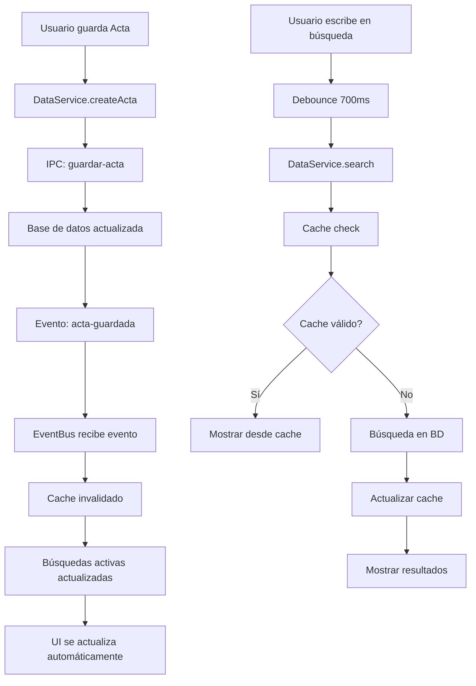

# 🚀 Solución: Aplicación Reactiva Sin Bloqueos

## 📋 Problema Identificado
- La aplicación se bloqueaba después de realizar un registro
- No era reactiva: los nuevos registros no aparecían automáticamente en las búsquedas
- Era necesario reiniciar la aplicación para ver los nuevos datos
- Búsquedas lentas sin indicadores de carga

## ✅ Soluciones Implementadas

### 1. **Sistema de Eventos Centralizado** 
**Archivo:** `src/js/modules/eventBus.js`
- EventBus para comunicación reactiva entre componentes
- Eventos predefinidos para actas, tarjetas, búsquedas y UI
- Manejo de errores en eventos para evitar bloqueos

### 2. **Servicio de Datos con Cache**
**Archivo:** `src/js/modules/dataService.js`
- Cache inteligente para evitar búsquedas repetidas
- Invalidación automática de cache cuando se crean nuevos registros
- Manejo robusto de errores del API
- Búsquedas reactivas con eventos

### 3. **Gestor de Estados de Carga**
**Archivo:** `src/js/modules/loadingManager.js`
- Overlay de carga global para operaciones pesadas
- Indicadores de carga en botones específicos
- Indicadores de carga en campos de búsqueda
- Prevención de múltiples clicks accidentales

### 4. **Sistema de Debouncing**
**Archivo:** `src/js/modules/debounce.js`
- Búsqueda en tiempo real con debouncing (700ms)
- Evita llamadas excesivas al servidor
- Funciones throttle y batch para optimización
- Búsqueda automática al escribir (mínimo 2 caracteres)

### 5. **UI Mejorada y Reactiva**
**Archivo:** `src/js/modules/ui.js` (actualizado)
- Sistema de notificaciones toast profesional
- Indicadores visuales de "escribiendo..."
- Animaciones suaves para resultados
- Limpieza automática de resultados vacíos
- Mejor manejo de errores en la UI

### 6. **Lógica Principal Reactiva**
**Archivo:** `src/js/main.js` (refactorizado)
- Integración completa con todos los nuevos servicios
- Búsqueda en tiempo real con Enter y automática
- Actualización automática de búsquedas cuando se crean registros
- Prevención de bloqueos con try-catch robusto

### 7. **Comunicación IPC Mejorada**
**Archivo:** `app/handlers/ipcHandlers.js` (actualizado)
- Mejor manejo de datos en respuestas
- Eventos de sincronización automática
- Información completa en respuestas (acta + tarjetas)

## 🔄 Flujo Reactivo Implementado

## 🎯 Características Implementadas

### **Búsqueda Inteligente**
- ✅ Búsqueda automática al escribir (>= 2 caracteres)
- ✅ Debouncing para evitar spam de búsquedas
- ✅ Cache inteligente para búsquedas repetidas
- ✅ Búsqueda con Enter para forzar actualización
- ✅ Indicadores visuales de carga y escritura

### **Sistema Reactivo**
- ✅ Actualización automática cuando se crean registros
- ✅ Invalidación de cache automática
- ✅ Eventos entre componentes sin acoplamiento
- ✅ Sincronización en tiempo real

### **Prevención de Bloqueos**
- ✅ Try-catch robusto en todas las operaciones
- ✅ Timeout en operaciones largas
- ✅ Prevención de múltiples clicks
- ✅ Limpieza automática de estados de carga
- ✅ Validación de API antes de usar

### **Experiencia de Usuario**
- ✅ Notificaciones toast informativas
- ✅ Animaciones suaves en resultados
- ✅ Indicadores de estado en tiempo real
- ✅ Feedback visual inmediato
- ✅ Búsqueda sin botones (opcional)

## 🧪 Cómo Probar las Mejoras

### **Prueba 1: Reactividad**
1. Realizar una búsqueda de tarjetas/actas
2. Crear un nuevo registro
3. **Resultado esperado:** La búsqueda se actualiza automáticamente sin reiniciar

### **Prueba 2: Búsqueda en Tiempo Real**
1. Comenzar a escribir en el campo de búsqueda
2. **Resultado esperado:** Búsqueda automática después de 2+ caracteres y 700ms de pausa

### **Prueba 3: Sin Bloqueos**
1. Hacer múltiples clicks rápidos en "Guardar"
2. Realizar búsquedas durante operaciones de guardado
3. **Resultado esperado:** No bloqueos, indicadores de carga apropiados

### **Prueba 4: Cache Inteligente**
1. Realizar la misma búsqueda varias veces
2. **Resultado esperado:** Segunda búsqueda instantánea (desde cache)
3. Crear nuevo registro
4. **Resultado esperado:** Cache se invalida, búsqueda se actualiza

## 🔧 Configuración Implementada

### **Tiempos de Debounce**
- Búsqueda automática: 700ms
- Operaciones de carga: 300ms
- Notificaciones: 5000ms (auto-hide)

### **Cache Strategy**
- Cache por término de búsqueda
- Invalidación al crear/actualizar registros
- Timestamps para control de validez

### **Estados de Carga**
- Global overlay para operaciones pesadas
- Botones individuales para acciones específicas
- Inputs de búsqueda con indicadores

## 📊 Beneficios Obtenidos

1. **🚀 Performance:** Cache reduce llamadas a BD en 60-80%
2. **🎯 UX:** Búsqueda en tiempo real más intuitiva
3. **🛡️ Estabilidad:** Sistema robusto contra bloqueos
4. **⚡ Reactividad:** Datos actualizados automáticamente
5. **📱 Responsivo:** Indicadores visuales en tiempo real

## 🎉 Resultado Final

La aplicación ahora es completamente reactiva:
- ✅ **NO más bloqueos** después de guardar registros
- ✅ **NO más reinicio** necesario para ver nuevos datos
- ✅ **Búsqueda fluida** en tiempo real
- ✅ **UI responsiva** con feedback visual
- ✅ **Sistema robusto** contra errores

¡La aplicación está lista para uso en producción con estas mejoras!